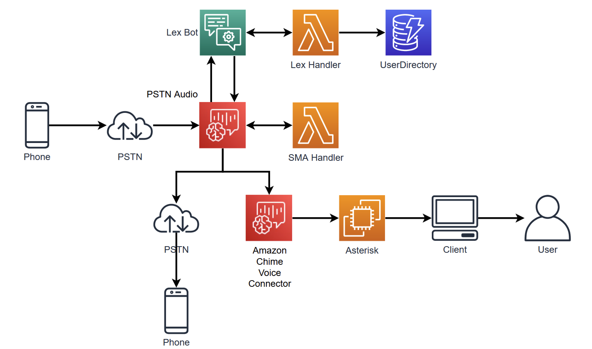
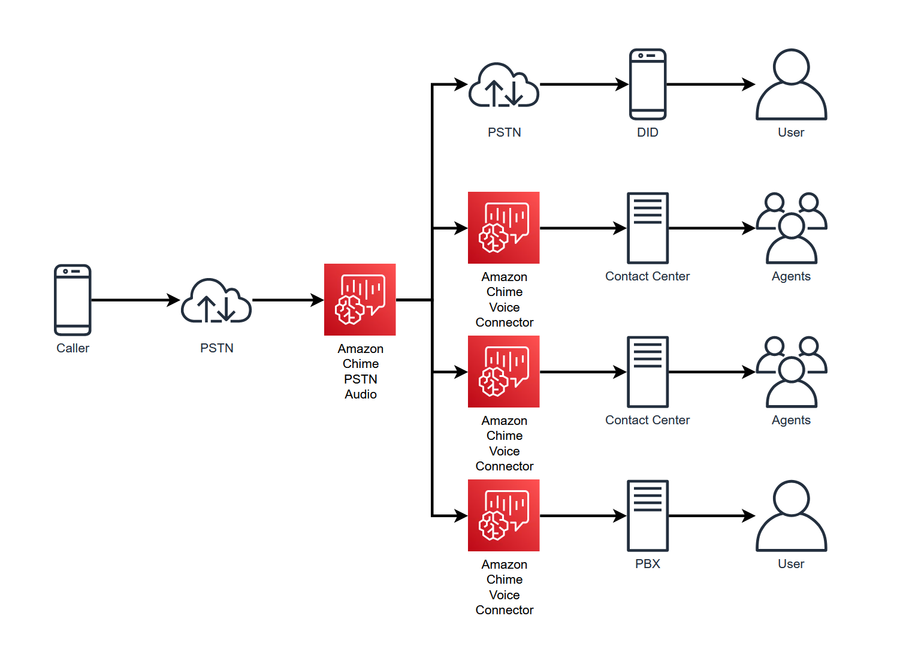
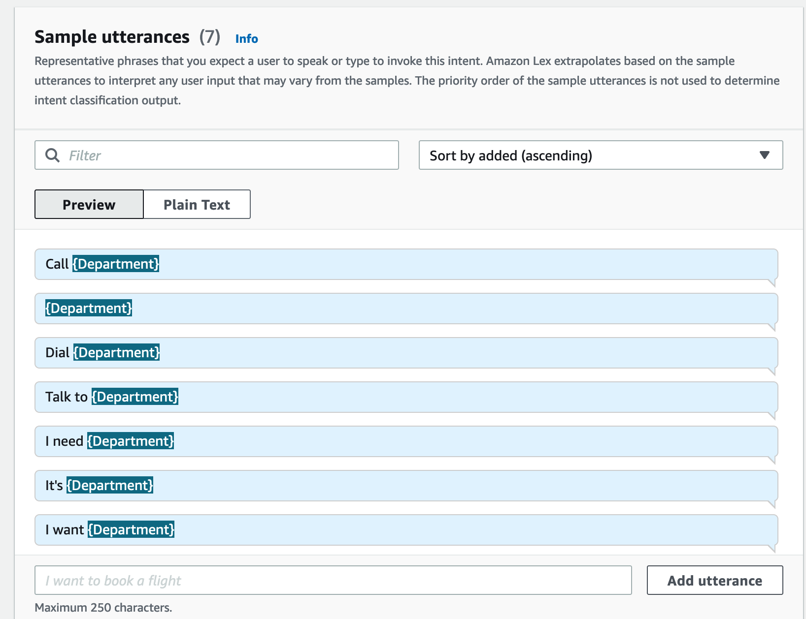
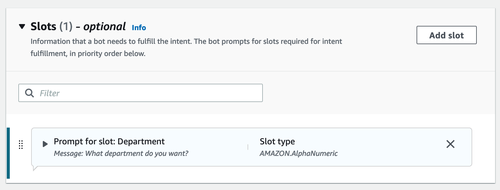
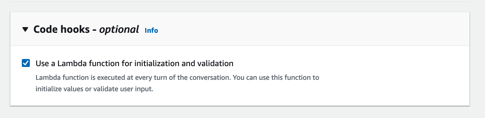
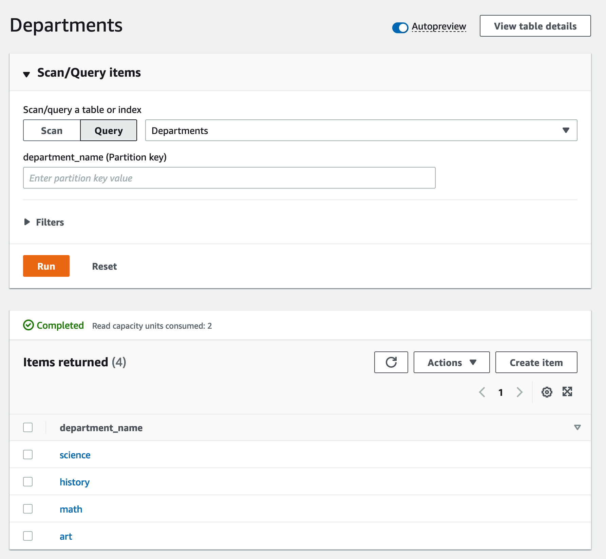
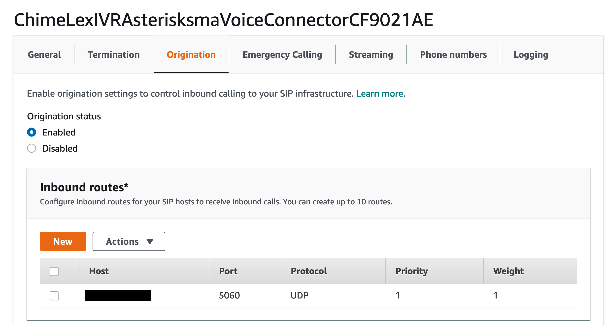
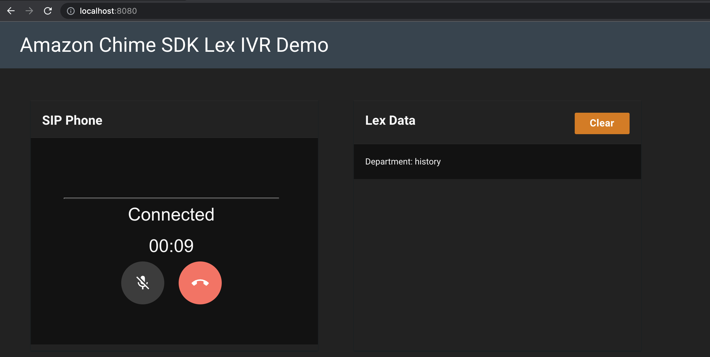
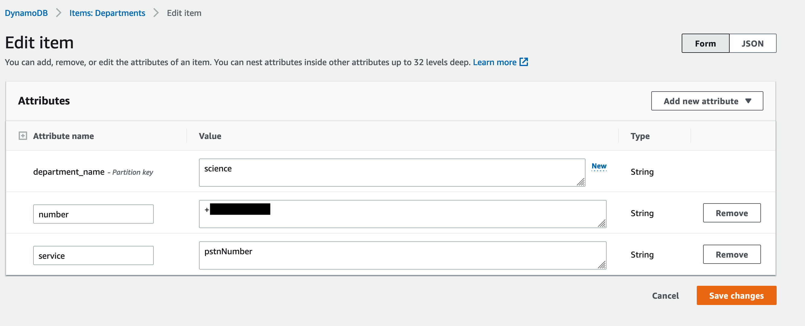

## Amazon Chime PSTN Audio Lex IVR



This demo will show how you can deploy a simple Interactive Voice Response (IVR) with [Amazon Lex](https://docs.aws.amazon.com/lex/latest/dg/what-is.html) that can intelligently route calls between multiple systems using the [Amazon Chime SDK PSTN Audio service](https://docs.aws.amazon.com/chime-sdk/latest/dg/build-lambdas-for-sip-sdk.html).

This demo assumes intermediate to advanced knowledge of the Amazon Chime SDK PSTN Audio service. An introductory workshop, Building Telephony-Powered Applications with the Amazon Chime SDK PSTN Audio Service can be found [here](https://catalog.us-east-1.prod.workshops.aws/workshops/30bd753c-9563-4c7c-8d1a-75460642550c/en-US).

This demo differs slightly from the previous Amazon Lex + Amazon Chime SDK [demo](https://github.com/aws-samples/amazon-chime-pstn-audio-with-amazon-lex) by offering a new call flow and simplifying the configuration required by the SIP endpoints. In this demo, the SIP endpoints are not required to query a database to extract information from the call, but can capture it directly from the SIP headers sent by the Amazon Chime SDK PSTN audio service through Amazon Chime Voice Connector.

## What It Does

This demo will deploy a fully working IVR that you can configure to route calls to either a Public Switched Telephone Network (PSTN) number or directly to an Amazon Chime SDK Voice Connector. This routing decision will be made based on the information passed from the Amazon Lex bot to the Amazon Chime SDK SIP media application. Calls routed to an Amazon Chime Voice Connector will contain additional Session Initiation Protocol (SIP) headers to pass information to the SIP user agent.



Amazon Chime PSTN Audio works with an AWS Lambda function to provide programmable telephony. This AWS Lambda function can be built to route calls using a wide range of conditions. In this demo we will be using an Amazon Lex bot to capture information used to make a routing decision, but other conditions could be used including time of day, calling number, called number, or DTMF collection. This routing decision can also be made with external data or services accessed by the AWS Lambda function including Amazon DynamoDB

## How It Works

### Inbound Call from PSTN

After deploying the CDK, a phone number will be provided to you:

```
Outputs:
ChimeLexIVR.pstnPhoneNumber = +1NPANXXXXXX
```

When this number is called, it will be delivered to an Amazon Chime SDK PSTN Audio SIP media application. When the SIP media application answers, the [startBotConversation](https://docs.aws.amazon.com/chime-sdk/latest/dg/start-bot-conversation.html) action will connect the call to an Amazon Lex bot.

```javascript
exports.handler = async (event, context, callback) => {
  console.log('Lambda is invoked with calldetails:' + JSON.stringify(event));
  let actions;
  switch (event.InvocationEventType) {
    case 'NEW_INBOUND_CALL':
      console.log('NEW INBOUND CALL');
      startBotConversationAction.Parameters.Configuration.SessionState.SessionAttributes.phoneNumber =
        event.CallDetails.Participants[0].From;
      actions = [startBotConversationAction];
      break;
```

### Amazon Lex Bot Processing

For background information on Amazon Lex and the terminology and features used in this demo, please see [Amazon Lex: How It Works](https://docs.aws.amazon.com/lex/latest/dg/how-it-works.html).

When the Amazon Lex Bot is engaged, it is looking for a single Intent to fill with the following Sample utterances:



When one of these utterances is captured, the `RouteCall` Intent will be used and the `Department` Slot will need to be captured to fulfill the Intent.



Because the Slot is captured as part of the sample Utterances, this will be fulfilled as soon as the Intent is invoked. However, the Amazon Lex Bot will need to verify that the Department spoken is a valid department. In order to do this, an optional code hook is used to perform validation. This code hook is an associated AWS Lambda function that will be executed at every turn of the conversation.



### Slot Validation

Once the Slot has been captured, validation will occur using an associated AWS Lambda [function](resources/lexHandler/index.py).

```python
def RouteCall(intent_request):
    session_attributes = get_session_attributes(intent_request)
    slots = get_slots(intent_request)
    department = get_slot(intent_request, "Department")
    query_department = get_department(department)
    if query_department:
        text = "Connecting you to " + department + " department."
        message = {"contentType": "PlainText", "content": text}
        fulfillment_state = "Fulfilled"
        return close(session_attributes, "RouteCall", fulfillment_state, message)
    else:
        session_attributes = {}
        try_ex(lambda: slots.pop("Department"))
        return elicit_slot(
            session_attributes,
            intent_request["sessionState"]["intent"]["name"],
            slots,
            "Department",
            {"contentType": "PlainText", "content": "What department are you looking for?"},
```

This AWS Lambda function will get the department spoken from the slot and compare that to a list of department names stored in an Amazon DynamoDB Table. The AWS Lambda is invoked with a JSON event that will be parsed. Below is a truncated example of the event.

```json
{
  "sessionState": {
    "sessionAttributes": {},
    "activeContexts": [],
    "intent": {
      "slots": {
        "Department": {
          "shape": "Scalar",
          "value": {
            "originalValue": "history",
            "resolvedValues": ["history"],
            "interpretedValue": "history"
          }
        }
      },
      "confirmationState": "None",
      "name": "RouteCall",
      "state": "InProgress"
    },
    "originatingRequestId": "7be9976e-50df-4e07-9d99-670445c55102"
  }
}
```

`department` will be set to the `interpretatedValue` here. In this case, `department` will be `history`. This value is then queried against the Amazon DynamoDB to see if it is a valid department. As part of the CDK deployment, an Amazon DynamoDB table is pre-populated with sample department names.



```python
def get_department(department_name):
    try:
        response = dynamodb_client.get_item(
            Key={
                "department_name": {
                    "S": str(department_name),
                },
            },
            TableName=department_table,
        )
        if "Item" in response:
            return True
        else:
            return False
    except Exception as err:
        logger.error("DynamoDB Query error: failed to fetch data from table. Error: ", exc_info=err)
        return None
```

When `history` is queried in the Amazon DynamoDB table, it returns a `True` value which will cause the AWS Lambda function to return the following to the Lex bot:

```json
{
  "messages": [
    {
      "contentType": "PlainText",
      "content": "Connecting you to history department."
    }
  ],
  "sessionState": {
    "dialogAction": { "type": "Close" },
    "sessionAttributes": {},
    "intent": { "name": "RouteCall", "state": "Fulfilled" }
  }
}
```

This JSON will tell the Amazon Lex bot the intent has been fulfilled and should be closed and play the `Connecting you to history department` message.

However, if the DynamoDB query fails because the name spoken does not exist in the DynamoDB table, the AWS Lambda function will return the following:

```json
{
  "messages": [
    {
      "contentType": "PlainText",
      "content": "What department are you looking for?"
    }
  ],
  "sessionState": {
    "sessionAttributes": {},
    "dialogAction": { "type": "ElicitSlot", "slotToElicit": "Department" },
    "intent": {
      "name": "RouteCall",
      "slots": {
        "Department": {
          "shape": "Scalar",
          "value": {
            "originalValue": "astronomy",
            "resolvedValues": ["astronomy"],
            "interpretedValue": "astronomy"
          }
        }
      }
    }
  }
}
```

This will cause the Lex bot to attempt to fulfill the `Department` slot again and prompt the caller with the `What department are you looking for?` message.

### Return to SIP media application

Once the `RouteCall` intent has been fulfilled in the Amazon Lex bot, the information will be returned to the Amazon Chime SDK SIP media application and the associated AWS Lambda function will be invoked with an `InvocationEventType: ACTION_SUCCESSFUL` with `Type: StartBotConversation` indicating that the Amazon Lex processing was completed successfully.

The associated AWS Lambda [function](resources/smaHandler/smaHandler.js) will then use the information it received to determine how to route the call:

```javascript
    case 'ACTION_SUCCESSFUL':
      console.log('ACTION SUCCESSFUL');
      switch (event.ActionData.Type) {
        case 'StartBotConversastion':
          const callerIdNumber = event.CallDetails.Participants[0].From;
          const lexDepartment =
            event.ActionData.IntentResult.SessionState.Intent.Slots.Department
              .Value.InterpretedValue;
          const route = await getRoute(lexDepartment);
          switch (route.service) {
            case 'voiceCconnector':
              vcCallAndBridgeAction.Parameters.CallerIdNumber = callerIdNumber;
              vcCallAndBridgeAction.Parameters.SipHeaders['X-LexInfo'] =
                lexDepartment;
              vcCallAndBridgeAction.Parameters.Endpoints[0].Uri = route.number;
              actions = [vcCallAndBridgeAction];
            case 'pstnNumber':
              pstnCallAndBridgeAction.Parameters.CallerIdNumber =
                callerIdNumber;
              pstnCallAndBridgeAction.Parameters.Endpoints[0].Uri =
                route.number;
              actions = [pstnCallAndBridgeAction];
            default:
              break;
          }
          break;
        case 'CallAndBridge':
          break;
        default:
          break;
      }
```

When the Amazon Chime SIP media application determines that the `ACTION_SUCCESSFUL` is for a `StartBotConversation` ActionData Type, the AWS Lambda function will extract the `lexDepartment` from the json in the event.

```json
            "SessionState": {
                "SessionAttributes": {},
                "Intent": {
                    "Name": "RouteCall",
                    "Slots": {
                        "Department": {
                            "Value": {
                                "OriginalValue": "history",
                                "InterpretedValue": "history",
                                "ResolvedValues": [
                                    "history"
                                ]
                            },
                            "Values": []
                        }
                    },
                    "State": "Fulfilled",
                    "ConfirmationState": "None"
                }
            },
```

It will then query the assocaited `Department` Amazon DynamoDB Table to determine which service to use to route the call and the number to use as the Uri when making this call. In the above Table example, all of the calls will be routed to the Amazon Chime Voice Connector.

### vcCallAndBridgeAction

The `vcCallAndBridgeAction` and `pstnCallAndBridgeAction` will both bridge calls, however, the `vcCallAndBridgeAction` will allow you to send calls to an Amazon Chime Voice Connector instead of a PSTN number. This will allow you to send additional SIP headers in the INVITE.

```javascript
{
    "SchemaVersion": "1.0",
    "Actions": [
        {
            "Type": "CallAndBridge",
            "Parameters": {
                "CallTimeoutSeconds": 30,
                "CallerIdNumber": "+1NPANXXXXXX",
                "Endpoints": [
                    {
                        "Uri": "600300",
                        "BridgeEndpointType": "AWS",
                        "Arn": "arn:aws:chime:us-east-1:104621577074:vc/ehwryzdm9hy4u6rrud7jym"
                    }
                ],
                "SipHeaders": {
                    "X-LexInfo": "history",
                }
            }
        }
    ]
}
```

In this example, the call is placed with a URI containing `600300` and delivered to an Amazon Chime Voice Connector which will deliver the call to the associated host.



In this demo, that host is an Asterisk server that is built as part of the deployment. Also included in this demo is a web based SIP client that can optionally be used to answer the incoming call.



As shown in this example, the department captured in the Lex bot will be delivered as a SIP header to the Asterisk server and then to the SIP client. The Request URI will contain the URI defined in the `CallAndBridge` action combined with the Inbound route of the Amazon Chime Voice Connector.

```SIP
INVITE sip:600300@192.0.2.31:5060;transport=UDP SIP/2.0
From: <sip:+1NPANXXXXXX@10.0.174.226:5060>;tag=56Htvc9UXX7Ug
To: <sip:600300@192.0.2.31:5060>;transport=UDP
X-Lexinfo: history
X-SMA-Max-Forwards: 4
X-VoiceConnector-ID: ehwryzdm9hy4u6rrud7jym
X-Amzn-TargetArn: arn:aws:chime:us-east-1:104621577074:vc/ehwryzdm9hy4u6rrud7jym
```

If the included SIP client is not used, the Asterisk server will answer the call and play back a message generated by Polly during the server deployment.

### pstnCallAndBridgeAction

To route a call to a PSTN number, in the Amazon DynamoDB Table, change the service to `pstnNumber` and change the number to an E.164 number. For example:



## Components Deployed

- Amazon Chime Voice Connector
- AWS Lambda - SIP media application Handler -[smaHandler.js](resources/smaHandler/smaHandler.js)
- AWS Lambda - AWS Lex code hook - [index.py](resources/lexHandler/index.py)
- AWS EC2 - Asterisk Server
- AWS DynamoDB - Department Table
- Amazon Lex Bot - CallRoute Demo

## Deployment

### Requirements

- [Node JS v12+](https://nodejs.org/en/download/) installed
- [yarn](https://yarnpkg.com/getting-started/install) installed
- AWS Account with appropriate permissions
- [Service Quota](https://us-east-1.console.aws.amazon.com/servicequotas/home/services/chime/quotas) allowance for Phone Numbers

### Deployment

```
yarn launch
```

### Client

To use the included web client SIP phone:

```
cd site
yarn
yarn run start
```

This will start a local server that can be accessed at `http://localhost:8080`.

### Cleanup

```
yarn destroy
```
