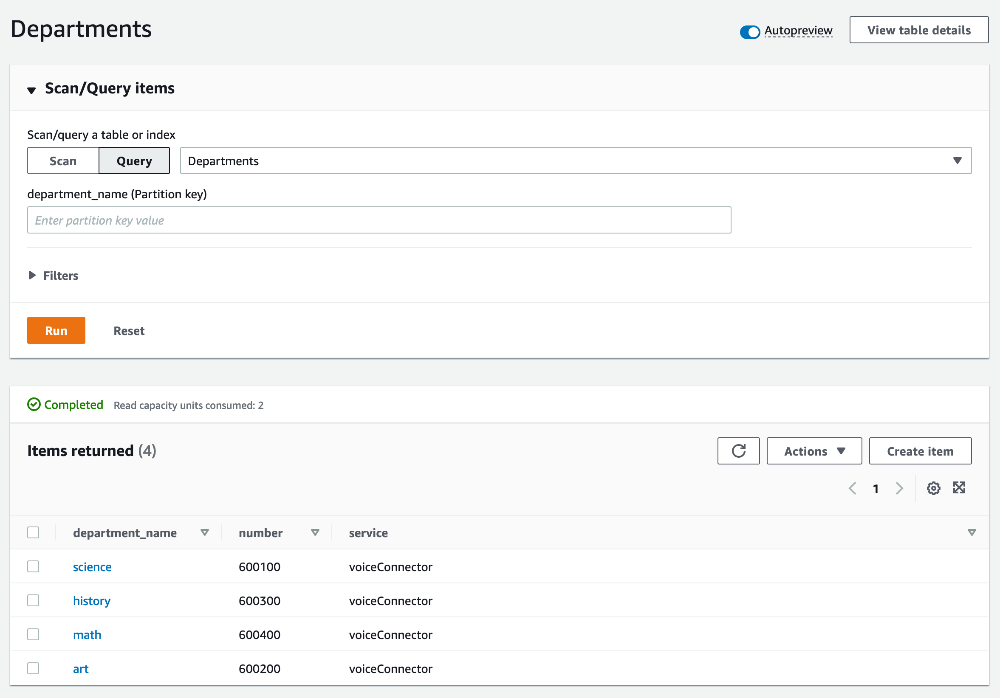
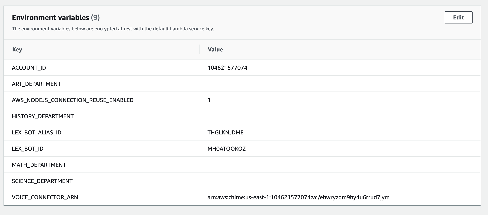

## Amazon Chime PSTN Audio Lex IVR


This demo will show how you can deploy a simple Interactive Voice Response (IVR) with Amazon Lex that can intelligently route calls between multiple systems using Amazon Chime PSTN Audio.

This demo assumes intermediary to advanced knowledge of Amazon Chime SDK PSTN Audio. See [here](https://docs.aws.amazon.com/chime-sdk/latest/dg/build-lambdas-for-sip-sdk.html) for background information on how Amazon Chime SDK PSTN Audio works. A basic workshop for Amazon Chime SDK PSTN Audio can be found [here](https://catalog.us-east-1.prod.workshops.aws/workshops/30bd753c-9563-4c7c-8d1a-75460642550c/en-US).

This demo differs slightly from the previous Amazon Lex + Amazon Chime SDK [demo](https://github.com/aws-samples/amazon-chime-pstn-audio-with-amazon-lex) by offering a new call flow and simplifying the configuration required by the SIP endpoints. In this demo, the SIP endpoints are not required to query a database to extract information from the call, but can capture it directly from the SIP headers included.

## What It Does

This demo will a fully working IVR that you can configure to route calls to either a Public Switched Telephone Network (PSTN) number or directly to an Amazon Chime SDK Voice Connector. This routing decision will be made based on the information passed from the Amazon Lex to the Amazon Chime SDK SIP media application. Calls routed to an Amazon Chime SDK Voice Connector will contain additional session inition protocol (SIP) headers to pass information to the SIP user agent.

## How It Works

### Inbound Call from PSTN

After deploying the CDK, a phone number will be provided to you:

```
Outputs:
ChimeLexIVR.pstnPhoneNumber = +1NPANXXXXXX
```

When this number is called, it will be delivered to an Amazon Chime SDK PSTN Audio SIP media application. This SIP media application will answer the call and connect to an Amazon Lex bot.

```javascript
exports.handler = async (event, context, callback) => {
  console.log('Lambda is invoked with calldetails:' + JSON.stringify(event));
  let actions;
  switch (event.InvocationEventType) {
    case 'NEW_INBOUND_CALL':
      console.log('NEW INBOUND CALL');
      startBotConversationAction.Parameters.Configuration.SessionState.SessionAttributes.phoneNumber =
        event.CallDetails.Participants[0].From;
      actions = [startBotConversationAction];
      break;
```

### Amazon Lex Bot Processing

For background information on Amazon Lex, see [here](https://aws.amazon.com/lex/faqs/).

When the Amazon Lex Bot is engaged, it is looking for a single Intent to fill with the following Sample utterances:


When one of these utterances is captured, the `RouteCall` Intent will be used and the `Department` Slot will need to be captured to fulfill the Intent.


Because the Slot is captured as part of the sample Utterances, this will be fullfilled as soon as the Intent is invoked. However, the Amazon Lex Bot will need to verify that the Department spoken is a valid department. In order to do this, an optional code hook is used to perform validation. This code hook is an associated AWS Lambda function that will be exexcuted at every turn of the conversation.


### Slot Validation

Once the Slot has been captured, validation will occur using an associated AWS Lambda [function](resources/lexHandler/index.py).

```python
def RouteCall(intent_request):
    session_attributes = get_session_attributes(intent_request)
    slots = get_slots(intent_request)
    department = get_slot(intent_request, "Department")
    query_department = get_department(department)
    if query_department:
        text = "Connecting you to " + department + " department."
        message = {"contentType": "PlainText", "content": text}
        fulfillment_state = "Fulfilled"
        return close(session_attributes, "RouteCall", fulfillment_state, message)
    else:
        session_attributes = {}
        try_ex(lambda: slots.pop("Department"))
        return elicit_slot(
            session_attributes,
            intent_request["sessionState"]["intent"]["name"],
            slots,
            "Department",
            {"contentType": "PlainText", "content": "What department are you looking for?"},
```

This AWS Lambda function will get the department spoken from the slot and compare that to a list of department names stored in an Amazon DynamoDB Table. The AWS Lambda is invoked with a JSON event that will be parsed. Below is a truncated example of the event.

```json
{
  "sessionState": {
    "sessionAttributes": {},
    "activeContexts": [],
    "intent": {
      "slots": {
        "Department": {
          "shape": "Scalar",
          "value": {
            "originalValue": "history",
            "resolvedValues": ["history"],
            "interpretedValue": "history"
          }
        }
      },
      "confirmationState": "None",
      "name": "RouteCall",
      "state": "InProgress"
    },
    "originatingRequestId": "7be9976e-50df-4e07-9d99-670445c55102"
  }
}
```

`department` will be set to the `interpretatedValue` here. In this case, `department` will be `history`. This value is then queried against the Amazon DynamoDB to see if it is a valid department. As part of the CDK deployment, an Amazon DynamoDB table is pre-populated with sample department names.



```python
def get_department(department_name):
    try:
        response = dynamodb_client.get_item(
            Key={
                "department_name": {
                    "S": str(department_name),
                },
            },
            TableName=department_table,
        )
        if "Item" in response:
            return True
        else:
            return False
    except Exception as err:
        logger.error("DynamoDB Query error: failed to fetch data from table. Error: ", exc_info=err)
        return None
```

When `history` is queried in the Amazon DynamoDB table, it returns a `True` value which will cause the AWS Lambda function to return the following to the Lex bot:

```json
{
  "messages": [
    {
      "contentType": "PlainText",
      "content": "Connecting you to history department."
    }
  ],
  "sessionState": {
    "dialogAction": { "type": "Close" },
    "sessionAttributes": {},
    "intent": { "name": "RouteCall", "state": "Fulfilled" }
  }
}
```

This JSON will tell the Amazon Lex bot the intent has been fulfilled and should be closed and play the `Connecting you to history department` message.

However, if the DynamoDB query fails because the name spoken does not exist in the DynamoDB table, the AWS Lambda function will return the following:

```json
{
  "messages": [
    {
      "contentType": "PlainText",
      "content": "What department are you looking for?"
    }
  ],
  "sessionState": {
    "sessionAttributes": {},
    "dialogAction": { "type": "ElicitSlot", "slotToElicit": "Department" },
    "intent": {
      "name": "RouteCall",
      "slots": {
        "Department": {
          "shape": "Scalar",
          "value": {
            "originalValue": "astronomy",
            "resolvedValues": ["astronomy"],
            "interpretedValue": "astronomy"
          }
        }
      }
    }
  }
}
```

This will cause the Lex bot to attempt to fullfill the `Department` slot again and prompt the caller with the `What department are you looking for?` message.

### Return to SIP media application

Once the `RouteCall` intent has been fulfilled in the Amazon Lex bot, the information will be returned to the Amazon Chime SDK SIP media application and associated AWS Lambda will be invoked with an `InvocationEventType: ACTION_SUCCESSFUL` with `Type: StartBotConversation` indicating that the Amazon Lex processing was completed successfully.

This will result in the associated AWS Lambda [function](resources/smaHandler/smaHandler.js) determining how to route the call:

```javascript
    case 'ACTION_SUCCESSFUL':
      console.log('ACTION SUCCESSFUL');
      if (event.ActionData.Type == 'StartBotConversation') {
        const callerIdNumber = event.CallDetails.Participants[0].From;
        const lexDepartment =
          event.ActionData.IntentResult.SessionState.Intent.Slots.Department
            .Value.InterpretedValue;
        if (lexDepartment in departments) {
          pstnCallAndBridgeAction.Parameters.CallerIdNumber = callerIdNumber;
          pstnCallAndBridgeAction.Parameters.Endpoints[0].Uri =
            departments[lexDepartment];
          actions = [pstnCallAndBridgeAction];
        } else {
          vcCallAndBridgeAction.Parameters.CallerIdNumber = callerIdNumber;
          vcCallAndBridgeAction.Parameters.SipHeaders['X-Lexinfo'] =
            lexDepartment;
          actions = [vcCallAndBridgeAction];
        }
        break;
```

As part of the CDK deployment, the SIP media application handler is built with several [environment variables](https://docs.aws.amazon.com/lambda/latest/dg/configuration-envvars.html). These variables can be used to route the call.



```javascript
var art = process.env['ART_DEPARTMENT'];
var math = process.env['MATH_DEPARTMENT'];
var science = process.env['SCIENCE_DEPARTMENT'];
var history = process.env['HISTORY_DEPARTMENT'];
var departments = {};
art && (departments.art = art);
math && (departments.math = math);
science && (departments.science = science);
history && (departments.history = history);
```

When the SIP media application Lambda is invoked with the information from Lex, the intepreted value will be extracted from the JSON.

```json
            "SessionState": {
                "SessionAttributes": {},
                "Intent": {
                    "Name": "RouteCall",
                    "Slots": {
                        "Department": {
                            "Value": {
                                "OriginalValue": "history",
                                "InterpretedValue": "history",
                                "ResolvedValues": [
                                    "history"
                                ]
                            },
                            "Values": []
                        }
                    },
                    "State": "Fulfilled",
                    "ConfirmationState": "None"
                }
            },
```

If the environment variables `HISTORY_DEPARTMENT` has been configured with an E.164 phone number, the AWS Lambda will return a `pstnCallAndBridgeAction` to the SIP media application and the call will be bridged with that E.164 number. However, if the associated department environment variable is blank, the AWS Lambda will return a `vcCallAndBridgeAction` action.

### vcCallAndBridgeAction

The `vcCallAndBridgeAction` and `pstnCallAndBridgeAction` will both bridge calls, however, the `vcCallAndBridgeAction` will allow you to send calls to an Amazon Chime SDK Voice Connector instead of a PSTN number. This will allow you to send additional SIP headers in the INVITE.

```javascript
{
    "SchemaVersion": "1.0",
    "Actions": [
        {
            "Type": "CallAndBridge",
            "Parameters": {
                "CallTimeoutSeconds": 30,
                "CallerIdNumber": "+1NPANXXXXXX",
                "Endpoints": [
                    {
                        "Uri": "+18155550100",
                        "BridgeEndpointType": "AWS",
                        "Arn": "arn:aws:chime:us-east-1:104621577074:vc/ehwryzdm9hy4u6rrud7jym"
                    }
                ],
                "SipHeaders": {
                    "X-LexInfo": "",
                    "X-Lexinfo": "history"
                }
            }
        }
    ]
}
```

In this example, the call is placed to `+18155550100` (a number not publically routed) and delivered to an Amazon Chime SDK Voice Connector which will deliver the call to the associated host.


In this demo, that host is an Asterisk server that is built as part of the deployment. Also included in this demo is a web based SIP client that can be used to answer the incoming call.


As shown in this example, the department captured in the Lex bot will be delivered as a SIP header to the Asterisk server and then to the SIP client.

```SIP
INVITE sip:+18155550100@44.194.55.161:5060;transport=UDP SIP/2.0
From: <sip:+1NPANXXXXXX@10.0.174.226:5060>;tag=56Htvc9UXX7Ug
To: <sip:+18155550100@44.194.55.161:5060>;transport=UDP
X-Lexinfo: history
X-SMA-Max-Forwards: 4
X-VoiceConnector-ID: ehwryzdm9hy4u6rrud7jym
X-Amzn-TargetArn: arn:aws:chime:us-east-1:104621577074:vc/ehwryzdm9hy4u6rrud7jym
```

## Components Deployed

- Amazon Chime Voice Connector
- AWS Lambda - SIP media application Handler -[smaHandler.js](resources/smaHandler/smaHandler.js)
- AWS Lambda - AWS Lex code hook - [index.py](resources/lexHandler/index.py)
- AWS EC2 - Asterisk Server
- AWS DynamoDB - Department Table
- Amazon Lex Bot - CallRoute Demo

## Deployment

### Requirements

- [Nodev12+](https://nodejs.org/en/download/) installed
- [yarn](https://yarnpkg.com/getting-started/install) installed
- AWS Account with approriate permissions
- [Service Quota](https://us-east-1.console.aws.amazon.com/servicequotas/home/services/chime/quotas) allowance for Phone Numbers

### Deployment

```
yarn launch
```

### Client

To use the included web client SIP phone:

```
cd site
yarn
yarn run start
```

This will start a local server that can be accessed at `http://localhost:8080`.

### Cleanup

```
yarn destroy
```
